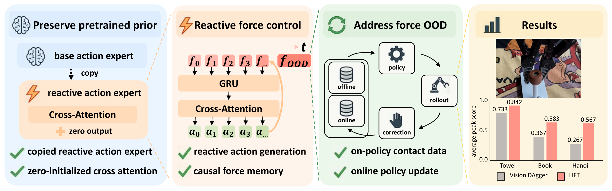

<h2 align="center">LIFT</h2>
<h3 align="center">Never Too Late for Force:<br>Accelerating VLA Post-Training with Reactive Force Injection</h3>

<p align="center">
  <a href="https://y-wng.github.io/">Yi Wang</a><sup>12*</sup>,
  <a href="https://wendichen.me">Wendi Chen</a><sup>12*‡</sup>,
  <a href="https://github.com/nssmd">Zimo Wen</a><sup>1*</sup>,
  <a href="https://hanxue.me">Han Xue</a><sup>1</sup>,
  Xueqi Li<sup>23</sup>,
  <a href="https://virlus.github.io/">Wenye Yu</a><sup>12</sup>,
  <br>
  Zhijie Chen<sup>1</sup>,
  Hao Yang<sup>1</sup>,
  <a href="https://lyuj1998.github.io">Jun Lv</a><sup>14</sup>,
  <a href="https://alvinwen428.github.io">Chuan Wen</a><sup>1†</sup>,
  <a href="https://www.mvig.org">Cewu Lu</a><sup>124†</sup>
  <br>
  <sup>1</sup>Shanghai Jiao Tong University &nbsp;
  <sup>2</sup>Shanghai Innovation Institute
  <br>
  <sup>3</sup>Southern University of Science and Technology &nbsp;
  <sup>4</sup>Noematrix Ltd.
  <br>
  <sup>*</sup>Equal contribution &nbsp;
  <sup>‡</sup>Project lead &nbsp;
  <sup>†</sup>Corresponding authors
</p>

<p align="center">
  <a href="https://arxiv.org/abs/2607.14236">📄 Paper</a> &nbsp;·&nbsp;
  <a href="https://lift-policy.github.io/">🌐 Project Page</a>
</p>

**LIFT (Late Reactive Injection of Force for VLA Post-Training)** adds contact
reactivity to pretrained π₀.₅ policies. A copied reactive action expert and
zero-initialized cross-attention inject causal force memory, while online DAgger
combines offline demonstrations with human corrections.

<p align="center">
  
</p>

Built on OpenPI, this repository provides **policy training and model inference**,
not a robot-control or data-collection stack.

## ⚙️ Installation

Use Linux, Python 3.11.8 or newer within the 3.11 series, CUDA-capable NVIDIA GPUs, and `uv`.

```bash
git clone https://github.com/y-wng/lift.git
cd lift
GIT_LFS_SKIP_SMUDGE=1 uv sync --locked
```

Dependencies are specified in `pyproject.toml` and pinned in `uv.lock`.

## 📚 Offline Training

1. **Prepare data.** Use LeRobot datasets with wrist images (`left_wrist_img`),
   7D `state` and `actions`, and task descriptions. The supplied task presets use
   10 Hz data. Set the dataset and checkpoint roots:

   ```bash
   export HF_LEROBOT_HOME=/path/to/lerobot
   export OPENPI_CHECKPOINT_ROOT=/path/to/checkpoints
   ```

2. **Configure the task.** Set the dataset `repo_id`, initialization
   `weight_loader`, and normalization `assets` in
   [src/openpi/training/config.py](src/openpi/training/config.py).
   The Book preset uses `flexiv/book_insertion_v3_100`, initializes from
   `$OPENPI_CHECKPOINT_ROOT/30000/params`, and reads statistics from
   `$OPENPI_CHECKPOINT_ROOT/30000/assets/flexiv/book_insertion_v3_100/norm_stats.json`.
   To compute statistics for new data, see [scripts/compute_norm_stats.py](scripts/compute_norm_stats.py).

3. **Train the offline π₀.₅ policy.** The Book preset uses two GPUs:

   ```bash
   CUDA_VISIBLE_DEVICES=0,1 uv run python scripts/train.py \
     pi05_iPhoneSingle_book_insertion_v3_100 \
     --exp-name offline \
     --checkpoint-base-dir "$OPENPI_CHECKPOINT_ROOT" \
     --no-wandb-enabled
   ```

   Checkpoints are saved under `<checkpoint-root>/<config>/<exp-name>/<step>/`.
   Task presets and data transforms are in `src/openpi/training/config.py`;
   training overrides and resume instructions are documented in [scripts/train.py](scripts/train.py).

## 🔄 Online DAgger Launchers

The online loop consists of policy inference, human correction, data transfer,
format conversion, and policy updates. The steps below describe this general
workflow; the quoted notes specify our LIFT setup.

1. **Real-world inference.** Run the current policy and connect its predictions
   to the robot's observation and action-execution loop.

   > **LIFT setup:** We deploy on a Flexiv robot arm. Model inference is provided
   > by [scripts/serve_policy.py](scripts/serve_policy.py), with a WebSocket client
   > in [packages/openpi-client](packages/openpi-client/src/openpi_client/websocket_client_policy.py).
   > Robot drivers and action execution are external to this repository.

2. **Human-intervention data collection.** Record corrective actions together
   with images, robot state, force measurements, and intervention labels.

   > **LIFT setup:** We use TDK for human-intervention data collection and save
   > the recordings locally in **NEDF2** format. The TDK collection system is
   > not included in this repository.

3. **Data upload.** Transfer completed episodes from the local collection
   computer to the training server, preserving their directory structure.

   > **LIFT setup:** Local NEDF2 episodes are uploaded to a cloud server before
   > conversion. Upload tooling is deployment-specific and is not bundled here.
   > Publish each episode's `.done` marker only after all files have arrived;
   > the converter also accepts the legacy `.down` marker.

4. **Format conversion.** Convert uploaded recordings into datasets that the
   training loader can consume.

   > **LIFT setup:** On the cloud server,
   > [scripts/nedf2_to_lerobot_incremental_flexiv_tdk.sh](scripts/nedf2_to_lerobot_incremental_flexiv_tdk.sh)
   > watches completed NEDF2 episodes and exports per-episode **LeRobot** datasets.
   > This optional conversion path requires the external `nmx_nedf_api` reader SDK.
   > The following command selects the Book task; other presets are listed in the script.

   ```bash
   SOURCE_DIR=/path/to/uploaded_nedf2 \
   OUTPUT_PATH=/path/to/lerobot_corrections \
   CONFIG_PATH=preprocess_data/configs/book_insertion_v3_online.yaml \
   bash scripts/nedf2_to_lerobot_incremental_flexiv_tdk.sh
   ```

5. **Online post-training.** Mix the new corrections with offline demonstrations,
   train the policy, and use an updated checkpoint for subsequent rollouts.

   > **LIFT setup:** The trainer scans completed LeRobot exports and uses a fixed
   > **1:1 offline:online** mixture. Online LIFT data requires 6D `left_wrench`
   > and `control_flag`; intervention chunks use `control_flag == -1` by default.
   > Set `OPENPI_INTERVENTION_VALUE` if your recordings use a different label.
   > Run training in a separate terminal from the converter, with
   > `OPENPI_LOCAL_LEROBOT_DATA_ROOT` pointing to the converter's `OUTPUT_PATH`.

   ```bash
   export OPENPI_INIT_CHECKPOINT=/path/to/offline_checkpoint/params
   export OPENPI_LOCAL_LEROBOT_DATA_ROOT=/path/to/lerobot_corrections
   bash scripts/train_online_dagger_lerobot_reactive.sh
   ```

Task, GPU, batch-size, data-layout, and resume options are documented in
[scripts/train_online_dagger_lerobot_reactive.sh](scripts/train_online_dagger_lerobot_reactive.sh).
Set `OPENPI_DRY_RUN=1` to preview either launcher without running it.
`OPENPI_ONLINE_REPO_ID` names a disposable output cache,
not an input dataset; keep it separate from source data.

## 🔬 Ablation

Use the same checkpoint and correction data as LIFT. Ratios below are
**offline:online**:

```bash
# Sampling ratio
bash scripts/train_online_dagger_lerobot_reactive_ratio_0to1.sh
bash scripts/train_online_dagger_lerobot_reactive_ratio_1to1.sh
bash scripts/train_online_dagger_lerobot_reactive_ratio_1to2.sh

# Force history: attend only to the first force-memory token
bash scripts/train_online_dagger_lerobot_reactive_no_force_history.sh
```

Ratio launchers require eligible online data before the first training step.
Set `OPENPI_ALLOW_OFFLINE_WARM_START=1` only when an offline warm start is intended.
Fractional batch quotas are carried across batches; sample counts are logged.

The force ablation sets `Pi0Config.use_force_history=False` and restricts
`make_cross_attn_mask` in [src/openpi/models/pi0.py](src/openpi/models/pi0.py); it does not remove force
conditioning. Sampling settings are documented in the corresponding wrappers.

## ⚖️ Baseline

Use the data roots configured above. The original π₀.₅ baseline uses
`OPENPI_INIT_CHECKPOINT`; the residual baseline uses a separate frozen base:

```bash
# Original π₀.₅: vision-only online DAgger
bash scripts/train_online_dagger_lerobot.sh

# Residual policy: frozen π₀.₅ with a trainable correction head
export OPENPI_BASE_INIT_CHECKPOINT="$OPENPI_INIT_CHECKPOINT"
bash scripts/train_online_dagger_lerobot_residual.sh
```

Baseline-specific data requirements, residual checkpoint loading, and target
generation are documented in these two launchers. The residual model is implemented
in [src/openpi/models/residual_policy.py](src/openpi/models/residual_policy.py).

## 🙏 Acknowledgements

LIFT is built on [OpenPI (π₀/π₀.₅)](https://github.com/Physical-Intelligence/openpi).
We also thank [ImplicitRDP](https://github.com/Chen-Wendi/ImplicitRDP),
[CR-DAgger](https://github.com/yifan-hou/cr-dagger), and
[RoboPocket](https://robopocket.github.io/) for their inspiring work on force-aware
policies and interactive policy learning, and for sharing their research with
the community.

## 🔗 Citation

If you find LIFT useful in your research, please consider citing our paper:

```bibtex
@article{wang2026lift,
  title   = {Never Too Late for Force: Accelerating {VLA} Post-Training with Reactive Force Injection},
  author  = {Wang, Yi and Chen, Wendi and Wen, Zimo and Xue, Han and Li, Xueqi
             and Yu, Wenye and Chen, Zhijie and Yang, Hao and Lv, Jun
             and Wen, Chuan and Lu, Cewu},
  journal = {arXiv preprint arXiv:2607.14236},
  year    = {2026},
  url     = {https://arxiv.org/abs/2607.14236}
}
```
